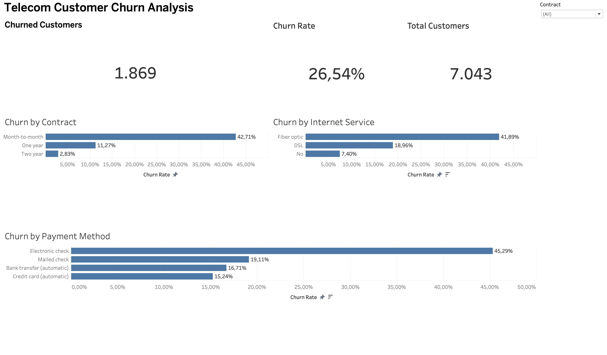

# Telecom Customer Churn Analysis

An interactive Tableau dashboard exploring customer churn across contract types, internet services, and payment methods

## Dashboard Preview



## Objective

Identify customer segments with higher observed churn rates and suggest areas for further investigation and retention initiatives

## Dataset

IBM Telco Customer Churn sample dataset, containing 7,043 customers

Each record represents a customer. The `Churn` field indicates whether the customer left the service

## Dashboard Features

- Total customers, churned customers, and overall churn rate
- Churn rate by contract type
- Churn rate by internet service
- Churn rate by payment method
- Contract filter applied across all dashboard worksheets
- Bars sorted by churn rate and axes fixed from 0% to 50%

## KPI Definitions

- **Total Customers:** distinct count of Customer ID
- **Churned Customers:** distinct count of Customer ID where Churn is Yes
- **Churn Rate:** churned customers divided by total customers within the selected segment

Tableau calculated field:

```tableau
COUNTD(IF [Churn] = "Yes" THEN [Customer ID] END)
/
COUNTD([Customer ID])
```

## Key Findings

With all contract types selected:

| Metric | Value |
|---|---:|
| Total customers | 7,043 |
| Churned customers | 1,869 |
| Overall churn rate | 26.54% |

- **Month-to-month contracts:** 42.71% churn, compared with 11.27% for one-year and 2.83% for two-year contracts
- **Fiber optic customers:** 41.89% churn, compared with 18.96% for DSL customers
- **Electronic check users:** 45.29% churn, the highest among the payment methods shown

These percentages describe churn within each group, rather than each group's share of all churned customers

## Business Recommendations

- Test retention offers for month-to-month customers and evaluate their impact against a control group
- Investigate service quality, pricing, and customer feedback among fiber optic customers
- Investigate why electronic check users have higher churn before proposing payment-related interventions

## Limitations

This is a descriptive analysis of a sample dataset. The observed relationships do not establish causation or predict individual customer churn

The 0–50% axes support the current overview. When filtering, check whether any segment exceeds 50%, as its bar may be clipped

## Files and Usage

- `Telecom_Customer_Churn.twbx` — packaged Tableau workbook
- `Dashboard.jpeg` — static dashboard preview

Download the workbook and open it in a compatible Tableau application. Use the Contract filter to explore segments and select All to restore the overview
